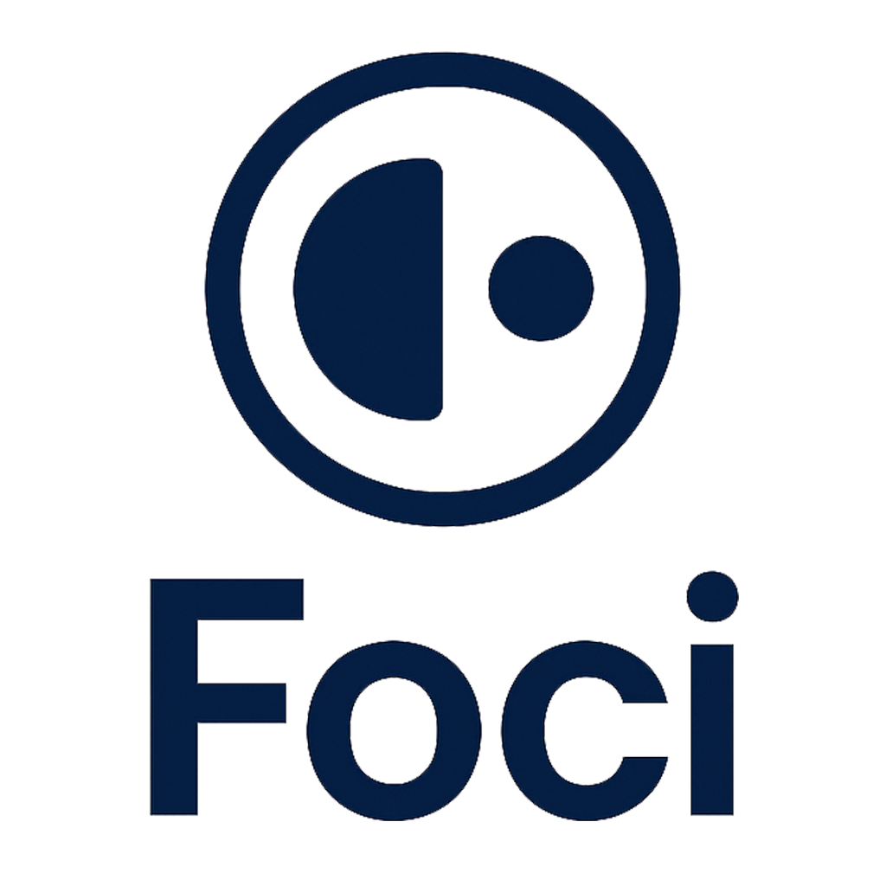

<div align="center">
  
  <p><strong>🎯 Your Personal Focus & Accountability Partner 🎯</strong></p>
  <p><i>Ditch the procrastination gremlins and crush your goals. Foci helps you stay on track with timed focus sessions, accountability buddies, and group challenges.</i></p>
</div>

<!-- [](https://github.com)
[](https://opensource.org/licenses/MIT)
[](CONTRIBUTING.md)
[](https://pnpm.io/) -->

---

Welcome to the Foci repository! This app is designed to be a clean, intuitive, and motivating tool to help you and your friends concentrate on what matters most.

## ✨ Core Features

- **🎯 Focus Timer:** A minimalist, distraction-free timer to help you get into a deep work state.
- **🤝 Buddies & Accountability:** Connect with friends, see who's focusing, and keep each other motivated.
- **👨‍👩‍👧‍👦 Group Sessions:** Create or join groups to tackle shared goals. Perfect for study groups or team projects!
- **🔥 Streaks & Gamification:** Build a focus streak and make productivity a rewarding habit.
- **📊 Progress Insights:** Visualize your work patterns with beautiful charts and see how you're spending your time.
- **📱 Seamless Mobile-First Experience:** Designed to work beautifully on any device.

## 🚀 Tech Stack & Architecture

This project is built with a modern, type-safe, and scalable stack, chosen to create a fantastic developer experience.

| Category     | Technologies                                                                                                                                                               |
| :----------- | :------------------------------------------------------------------------------------------------------------------------------------------------------------------------- |
| **Frontend** | [**React 19**](https://react.dev/) \| [**Vite**](https://vitejs.dev/) \| [**TypeScript**](https://www.typescriptlang.org/) \| [**Tailwind CSS**](https://tailwindcss.com/) |
| **Backend**  | [**Firebase**](https://firebase.google.com/) (Authentication, Firestore, Hosting)                                                                                          |
| **UI/UX**    | [**Shadcn/UI**](https://ui.shadcn.com/) (via `components.json`) \| [**Framer Motion**](https://www.framer.com/motion/) \| [**Recharts**](https://recharts.org/)            |
| **Routing**  | [**React Router**](https://reactrouter.com/) \| `vite-plugin-pages`                                                                                                        |
| **Tooling**  | [**pnpm**](https://pnpm.io/) \| [**ESLint**](https://eslint.org/) \| [**Vitest**](https://vitest.dev/)                                                                     |

### 🏛️ Architectural Philosophy

- **Feature-Sliced Design:** The `src/features` directory organizes code by business domain, making it easy to locate related components, hooks, and services. This keeps the codebase modular and scalable.
- **Component-Driven UI:** A strong emphasis on reusable and composable components, located in `src/components`. We use skeletons for loading states to ensure a smooth user experience.
- **Type Safety:** TypeScript is used throughout the project to catch errors early and improve code quality and maintainability.
- **Centralized Configuration:** Firebase and other configurations are kept in the `src/lib` directory for easy management.

---

## 🏁 Getting Started

Ready to jump in? Follow these steps to get the development environment up and running.

### Prerequisites

- [Node.js](https://nodejs.org/) (v18 or higher)
- [pnpm](https://pnpm.io/installation)
- A [Firebase](https://firebase.google.com/) project.

### Installation & Setup

1.  **Clone the repository:**

    ```bash
    git clone https://github.com/luckygoswami/foci.git
    cd foci
    ```

2.  **Install dependencies:**

    ```bash
    pnpm install
    ```

3.  **Set up Firebase:**

    - Create a new project on the [Firebase Console](https://console.firebase.google.com/).
    - Create a new Web App in your Firebase project.
    - Copy the Firebase configuration object.
    - Create a `.env.local` file in the root of the project and paste your config there:

    ```env
    # .env.local

    VITE_FIREBASE_API_KEY="your-api-key"
    VITE_FIREBASE_AUTH_DOMAIN="your-auth-domain"
    VITE_FIREBASE_PROJECT_ID="your-project-id"
    VITE_FIREBASE_STORAGE_BUCKET="your-storage-bucket"
    VITE_FIREBASE_DATABASE_URL="your-database-url"
    VITE_FIREBASE_MESSAGING_SENDER_ID="your-messaging-sender-id"
    VITE_FIREBASE_APP_ID="your-app-id"
    ```

4.  **Run the development server:**
    ```bash
    pnpm dev
    ```

The app should now be running on `http://localhost:5173` (or another port if 5173 is busy).

### Available Scripts

- `pnpm dev`: Starts the development server with hot-reloading.
- `pnpm build`: Bundles the app for production.
- `pnpm preview`: Serves the production build locally.
- `pnpm lint`: Lints the codebase using ESLint.

---

## 🤝 Contributing

Contributions are what make the open-source community such an amazing place to learn, inspire, and create. Any contributions you make are **greatly appreciated**.

Please read our [CONTRIBUTING.md](CONTRIBUTING.md) for details on our code of conduct and the process for submitting pull requests.

## 📜 License

This project is distributed under the MIT License. See [LICENSE](LICENSE) for more information.

---

<div align="center">
  <code>> Compiled with focus by Deepak Goswami.</code>
</div>
